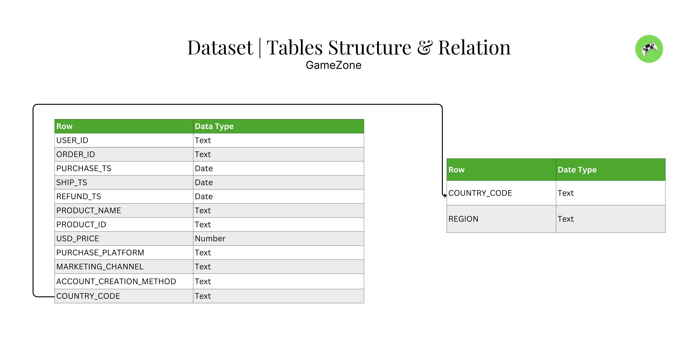

# Data Integrity & Supply Chain Audit for GameZone Global

## 🚀 Project Dashboard

# Data Integrity & Supply Chain Audit for GameZone Global

**Role:** BI Analyst  
**Domain:** Global E-Commerce & Retail  
**Tools:** MS Excel  

---

## 1. Business Context & Objective

### The Scenario
GameZone is a global retailer of gaming hardware operating through both online channels and physical retail stores. The Executive Board is preparing for a quarterly strategy review and requires answers to three critical questions:

- **Product Portfolio:** Which products are driving the highest revenue vs. volume?
- **Logistics Performance:** How efficient is our delivery system across different regions?
- **Geographical Growth:** Which regions are generating the most sales, and where is market penetration highest?

### The Problem
The raw sales data, though voluminous, was structurally compromised. Initial scans revealed logic errors (e.g., delivery preceding orders) and transaction anomalies that would have led to incorrect strategic decisions if analyzed in its raw state.

### The Objective
To perform a rigorous Data Cleaning & Logic Audit to produce a **"Golden Dataset."**  
My goal was not just to fix errors, but to create a reliable foundation that allows the next analyst to answer the executive questions with confidence.

---

## 2. Data Architecture & Scope

The project simulates a **"messy," real-world enterprise dataset** consisting of two core tables:

- **Master Sales Table**  
  Transaction-level data (Order ID, User ID, Dates, Product Info)

- **Regional Code Table**  
  Geo-mapping data for country and store locations

### The Workflow
1. **Ingestion:** Loading raw datasets  
2. **Audit:** Creating a detailed **Issue Log** (Location, Frequency, Magnitude)  
3. **Remediation:** Applying business logic to clean or flag data  
4. **Final Output:** A "ready-for-analysis" dataset + Business Report  

---

## 3. Business Logic Transformation

I applied strict commercial logic to the cleaning process.  
I did not just look for **"null values";** I looked for **"business impossibilities."**

| Data Check | Business Logic Applied | Commercial Impact ("The So What") |
|-----------|------------------------|----------------------------------|
| **Logistics Logic** | `Shipping_Date` must be > `Purchase_Date` | Ensures the Supply Chain team calculates accurate "Order-to-Delivery" KPIs. |
| **Identity Logic** | Different `User_IDs` cannot share the same `Order_ID` | Critical for calculating **Customer Lifetime Value (CLV)** and retention rates. |
| **Financial Logic** | Transactions cannot be $0 (excluding specific promo codes) | Prevents revenue under-reporting and identifies potential checkout system errors. |
| **Geo-Standardization** | Standardized Country/Region codes | Enables accurate heat-mapping for the Marketing team's regional budget allocation. |

---

## 4. Root Cause Analysis & Critical Findings

This is the core value of the project.  
Beyond simple cleaning, I diagnosed two systemic issues within GameZone's operations.

### 🚩 Case 1: The "Time Travel" Operational Glitch (9.15% of Data)

- **The Issue:** A significant portion (9.15%) of entries listed a delivery date *before* the purchase date.
- **Business Risk:** This prevents the Executive Board from answering Question #2 ("How is our delivery system doing?").
- **Action Taken:** Due to data constraints, deleting 9% of sales would skew revenue figures. I **flagged these rows** in the Issue Log with a side note for the Senior Analyst to consult the Operations Department before including them in time-based metrics.

### 🚩 Case 2: The "Nintendo Switch" Concurrency Bug (0.7% of Data)

- **The Issue:** Duplicate `Order_IDs` were assigned to different `User_IDs`.
- **The Pattern:** My investigation found a 100% correlation: This **only** occurred with **"Nintendo Switch"** consoles purchased via the **"Website"**.
- **Root Cause Diagnosis:** This suggests a technical **Race Condition**. During a high-traffic sales campaign (likely a flash sale), multiple users clicked "Buy" simultaneously, and the backend system failed to differentiate the sessions, assigning a common Order ID.
- **Action Taken:** Flagged as a **"Technical Glitch"** and documented for the Web Engineering team to prevent future revenue tracking errors.

---

## 5. Final Deliverables

The following assets are now prepared for the Analytics Team:

- **✅ The Golden Dataset**  
  Cleaned, standardized, and ready for Power BI/Tableau ingestion.
  [resources/Cleaned_data_gamezone.xlsx](resources/Cleaned_data_gamezone.xlsx)

- **📋 The Issue Log**  
  A detailed audit trail of every error found, its frequency, and the action taken (Fixed vs. Flagged).

- **📝 Analyst Note**  
  A guide explaining how to handle the flagged "Time Travel" and "Nintendo Switch" rows during the analysis phase.

## 🏆 Skills Demonstrated in this Project

### Hard Skills

### Soft Skills

